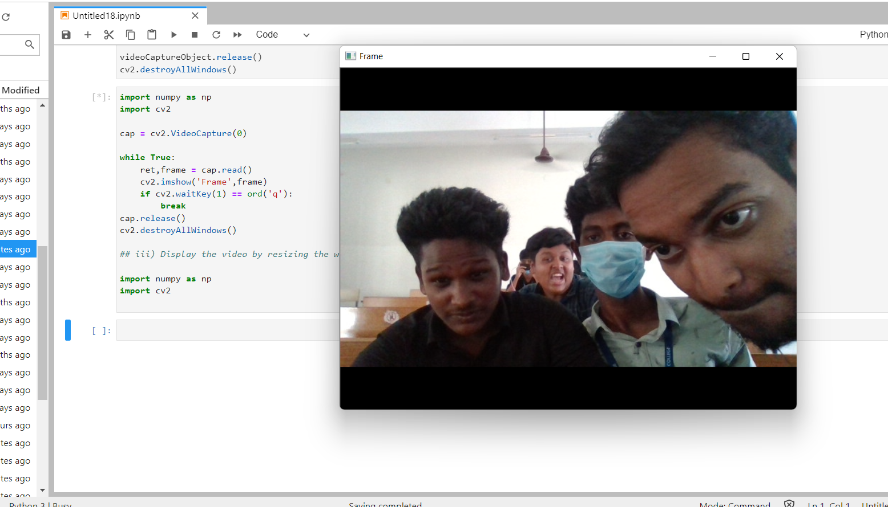
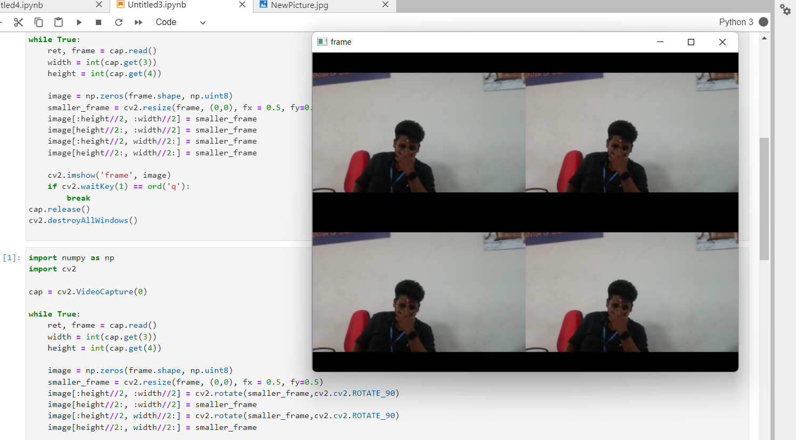
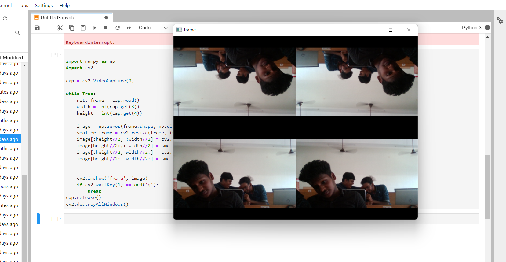

# Image-Acquisition-from-Web-Camera
## Aim
 
Aim:
 
To write a python program using OpenCV to capture the image from the web camera and do the following image manipulations.
i) Write the frame as JPG 
ii) Display the video 
iii) Display the video by resizing the window
iv) Rotate and display the video

## Software Used
Anaconda - Python 3.7
## Algorithm
### Step 1: Import cv2 and capture the video using cv2.VideoCapture(0)
<br>

### Step 2: Write the captured image using cv2.imwrite("NewPicture.jpg",frame)
<br>

### Step 3: Resize the image using cv2.resize(frame, (0,0), fx = 0.5, fy=0.5)
<br>

### Step 4: Display the image until the loop gets over

<br>

### Step 5: Rotate the image using cv2.rotate(smaller_frame,cv2.cv2.ROTATE_180)

## Program:
``` Python
### Developed By: Shyam Kumar A
### Register No: 212221230098

```

## i) Write the frame as JPG file
~~~
import cv2
videoCaptureObject = cv2.VideoCapture(0)
while(True):
    ret,frame = videoCaptureObject.read()
    cv2.imwrite("NewPicture.jpg",frame)
    result = False
videoCaptureObject.release()
cv2.destroyAllWindows()
~~~


## ii) Display the video
~~~
import numpy as np
import cv2
cap = cv2.VideoCapture(0)
while True:
    ret,frame = cap.read()
    cv2.imshow('Frame',frame)
    if cv2.waitKey(1) == ord('q'):
        break
cap.release()
cv2.destroyAllWindows()
~~~


## iii) Display the video by resizing the window
~~~

import numpy as np
import cv2

cap = cv2.VideoCapture(0)

while True:
    ret, frame = cap.read()
    width = int(cap.get(3))
    height = int(cap.get(4))
    
    image = np.zeros(frame.shape, np.uint8)
    smaller_frame = cv2.resize(frame, (0,0), fx = 0.5, fy=0.5)
    image[:height//2, :width//2] = smaller_frame
    image[height//2:, :width//2] = smaller_frame
    image[:height//2, width//2:] = smaller_frame
    image[height//2:, width//2:] = smaller_frame

    cv2.imshow('frame', image)
    if cv2.waitKey(1) == ord('q'):
        break
cap.release()
cv2.destroyAllWindows()
~~~


## iv) Rotate and display the video
~~~
import numpy as np
import cv2

cap = cv2.VideoCapture(0)

while True:
    ret, frame = cap.read()
    width = int(cap.get(3))
    height = int(cap.get(4))
    
    image = np.zeros(frame.shape, np.uint8)
    smaller_frame = cv2.resize(frame, (0,0), fx = 0.5, fy=0.5)
    image[:height//2, :width//2] = cv2.rotate(smaller_frame,cv2.ROTATE_180)
    image[height//2:,: width//2] = smaller_frame
    image[:height//2, width//2:] = cv2.rotate(smaller_frame,cv2.ROTATE_180)
    image[height//2:, width//2:] = smaller_frame


    cv2.imshow('frame', image)
    if cv2.waitKey(1) == ord('q'):
        break
cap.release()
cv2.destroyAllWindows()
~~~
## Output

### i) Write the frame as JPG image
</br>
</br>


### ii) Display the video
</br>
</br>


### iii) Display the video by resizing the window
</br>
</br>



### iv) Rotate and display the video
</br>
</br>



## Result:
Thus the image is accessed from webcamera and displayed using openCV.
